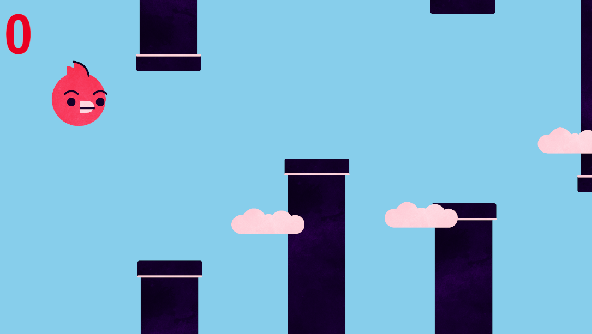
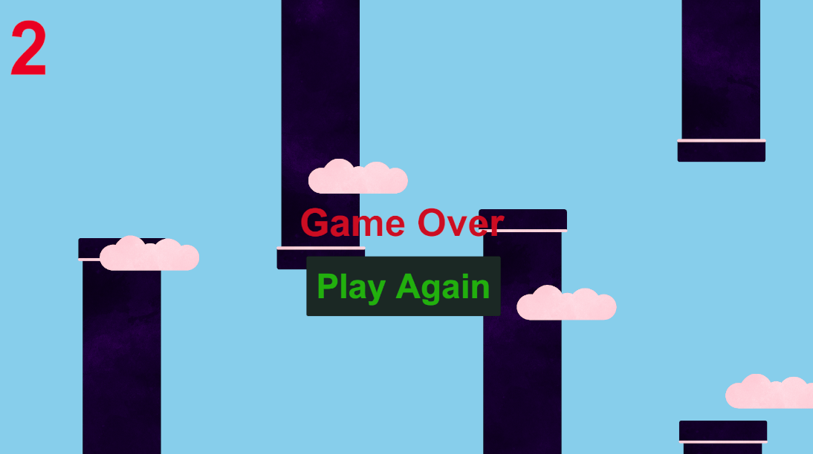

## Flappy Bird (Unity)

A simple Flappy Bird clone built in Unity using 2D physics, basic UI, and C# scripting.
The player controls a bird that must fly through gaps between moving pipes without hitting them or going out of bounds.

---

### 🎮 Gameplay Overview

- **Goal**: Fly as far as possible and earn points by passing through the middle of pipe pairs.
- **Mechanics**:
  - Press **Space** to flap and move the bird upward.
  - Pipes continuously move from **right to left**.
  - The game ends when:
    - The bird **collides** with a pipe, or
    - The bird goes **off the vertical bounds** of the screen.
- **Scoring**:
  - Every time the bird passes through the **middle trigger** of a pipe pair, the score increases by **1** and a **score sound effect** plays.

---

### 🧩 Core Scripts & Their Functions

#### `BirdScript.cs`
- Controls the **player character (bird)**.
- Uses a `Rigidbody2D` (`myrigidbody`) to apply physics-based movement.
- Key behaviors:
  - On **Space key press** and if the bird is alive:
    - Sets the rigidbody’s velocity upwards using `flapStrength`.
  - Continuously checks the bird’s **vertical position**:
    - If `y > 17` or `y < -17`, it triggers **Game Over**.
  - On any **2D collision** (`OnCollisionEnter2D`):
    - Calls `LogicScript.GameOver()`.
    - Sets `birdIsAlive = false` to stop further input.
- Automatically finds the `LogicScript` instance via a GameObject tagged **"Logic"**, and logs helpful errors if not found.

#### `PipeMoveScript.cs`
- Controls **horizontal movement** of each pipe.
- Key behaviors:
  - In `Update()`, moves the pipe **left** at `moveSpeed` units per second.
  - When the pipe’s `x` position is less than a **dead zone** (`-45f`), it:
    - **Destroys** the pipe GameObject.
    - Logs `"Pipe Deleted"` for debugging.

#### `PipeSpawnScript.cs`
- Responsible for **spawning new pipes** at a regular interval.
- Key fields:
  - `pipe`: The pipe prefab to instantiate.
  - `spawnRate`: Time in seconds between spawns.
  - `heightOffset`: Random vertical range for spawning.
- Key behaviors:
  - Calls `SpawnPipe()` once in `Start()`.
  - In `Update()`, uses a **timer**:
    - When `timer >= spawnRate`, spawns a new pipe and resets `timer`.
  - `SpawnPipe()`:
    - Calculates a `highestPoint` and `lowestPoint` using `heightOffset`.
    - Instantiates a pipe at a **random Y position** within that range, at the spawner’s X position.

#### `LogicScript.cs`
- Manages **game state**, **UI score**, **Game Over screen**, and **restarting the game**.
- Key fields:
  - `playerScore`: Current score value.
  - `scoreText`: A `Text` UI element showing the score.
  - `gameOverScreen`: A GameObject for the **Game Over UI panel**.
  - `audioSource`: Plays a sound when score increases.
- Key functions:
  - `AddScore(int score)`:
    - Increases `playerScore` by `score`.
    - Updates `scoreText` to show the new score.
    - Plays the **score sound effect**.
  - `RestartGame()`:
    - Reloads the **current active scene**.
  - `GameOver()`:
    - Activates `gameOverScreen` to show the Game Over UI.

#### `PipeMiddleScript.cs`
- Handles **scoring triggers** between the pipes.
- Expected to be attached to a **trigger collider** placed in the gap between the top and bottom pipes.
- On `Start()`:
  - Finds the `LogicScript` using the GameObject tagged **"Logic"**.
  - Logs errors if it cannot find the manager or the component.
- On `OnTriggerEnter2D(Collider2D collision)`:
  - If the colliding object is on **layer 3** (typically the bird layer):
    - Calls `logicScript.AddScore(1)` if `logicScript` is valid.
    - Warns in the Console if `logicScript` is missing.

---

### 🧱 Project Structure (Relevant Parts)

- **`Assets/Scenes/SampleScene.unity`**
  Main game scene containing:
  - Bird GameObject with `BirdScript` and `Rigidbody2D`.
  - Pipe spawner with `PipeSpawnScript`.
  - Pipe prefab with:
    - `PipeMoveScript` on the whole pipe.
    - `PipeMiddleScript` on a trigger in the gap.
  - Logic manager object (tagged `"Logic"`) with `LogicScript`.
  - UI Canvas with:
    - Score text.
    - Game Over panel.

- **`Assets/`**
  - Sprites:
    - `unitytut-birdbody.png`
    - `unitytut-birdwingup.png`
    - `unitytut-birdwingdown.png`
    - `unitytut-pipe.png`
    - `unitytut-cloud.png`
  - Audio:
    - `Free Score Sound Effects Download.mp3`
    - `game-over-deep-male-voice-clip-352695.mp3` (configurable in UI/Game Over logic if you hook it up).
  - Prefabs:
    - `Pipe.prefab`
    - `unitytut-cloud.prefab`

---

### 🕹 Controls

- **Space**: Make the bird flap upward.
- **Mouse / UI button (optional, if added)**: Can be wired to `RestartGame()` to restart the level from the Game Over screen.

---

### 🖼 Sample UI Preview

*(Replace this with an actual screenshot of your scene or UI when ready.)*

**Main Game Screen:**
- **Top-center**: White score text showing the current score (e.g., `0`, `1`, `2`, …).
- **Center**: Bird character with wing-up/wing-down animation using the body and wing sprites.
- **Right side**: Pipes moving in from the right, with the gap at random heights.
- **Background**: Cloud sprites (`unitytut-cloud.png`) for parallax-style sky visuals (if used).

**Game Over Screen:**
- When the player dies:
  - A **Game Over panel** appears (linked to `gameOverScreen`).
  - The final score remains visible.
  - A **Restart button** (if configured) calls `LogicScript.RestartGame()`.

You can add a screenshot section like:

### 📸 Screenshots

#### In-Game

#### Game Over Screen

### 🚀 How to Run the Project

1. **Open in Unity**:
   - Open **Unity Hub**.
   - Click **Add** and select the `Flappy-Bird` folder.
   - Open the project.

2. **Open the Scene**:
   - Navigate to `Assets/Scenes/`.
   - Open `SampleScene.unity`.

3. **Play**:
   - Press the **Play** button in the Unity Editor.
   - Press **Space** to flap and start playing.

---

### 🔧 Possible Improvements

- Add **touch controls** for mobile (tap to flap).
- Add **start menu** and **pause menu**.
- Add **high score saving** using `PlayerPrefs`.
- Add **background music** and separate sound for Game Over.
- Improve animations and add more polish (screen shake, particle effects, etc.).

---

### 📄 License

You can add your own license information here (MIT, personal use, etc.).
